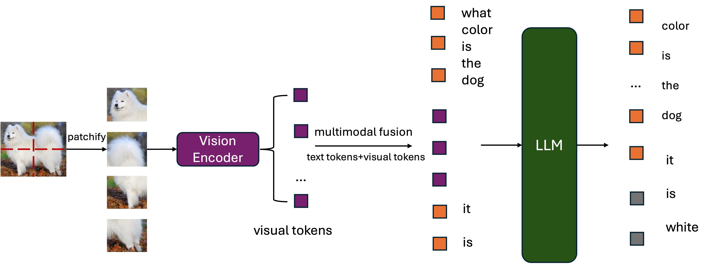
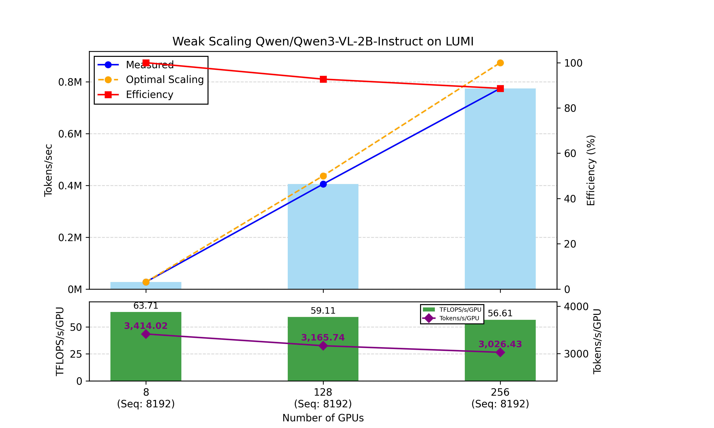
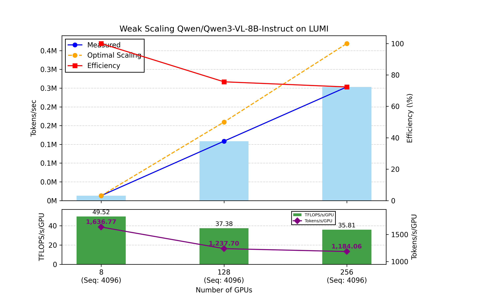
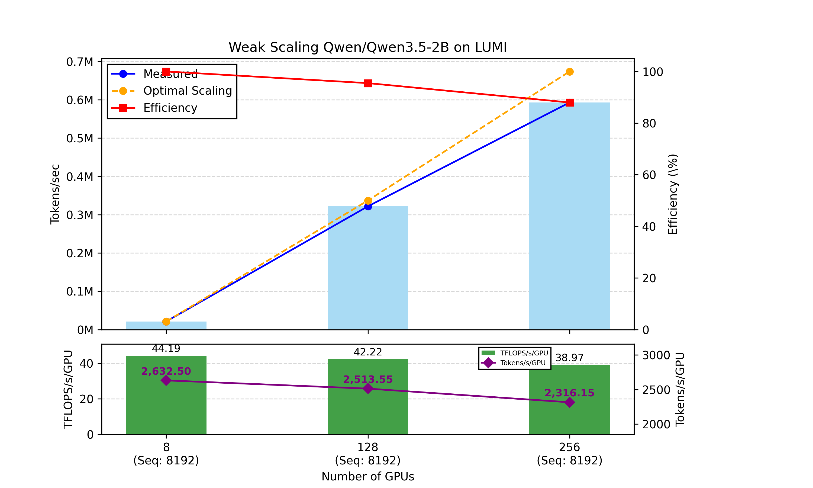
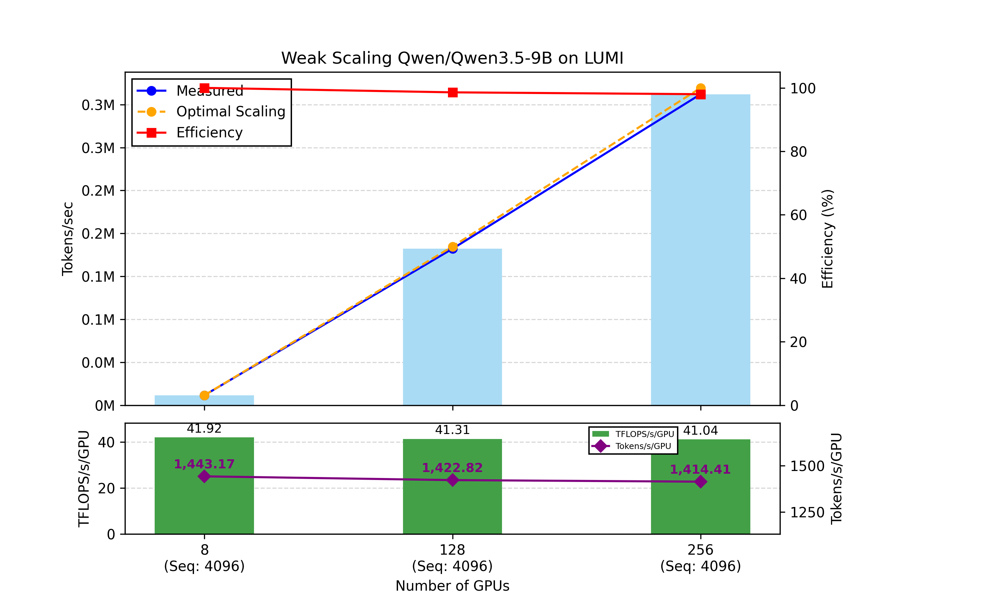

# Training Visual Language Models (VLMs) on LUMI

## Introduction
Large Language Models (LLMs) have transformed the field of artificial intelligence by enabling machines to "understand" and "generate" human language with remarkable performance. Models such as GPT, Llama, Qwen, and Mistral have demonstrated strong capabilities in tasks including text generation, question answering, summarization, translation, and code generation.

Despite their success, traditional LLMs are limited to textual information. Humans, however, interact with the world through multiple modalities, including vision, audio, and language. Many real-world tasks require reasoning across these different forms of information. For example:

- Understanding an image and answering questions about it.
- Describing a video in natural language.
- Interpreting speech and generating textual responses.
- Combining visual and textual information to perform complex reasoning.

These limitations have motivated the development of Multimodal Large Language Models (MLLMs).

### Multimodal Large Language Models
Multimodal Large Language Models extend traditional LLMs by incorporating additional input, such as images, audio, video or other types of data, beyond text. The model processes these inputs and produces outputs typically in textual form, although some advanced systems can also generate images, audio, or videos.

Compared with text-only LLMs, multimodal models introduce several additional components: vision encoders for processing images; or audio encoders for speech and sound; modality projection layers that align different modalities into a shared embedding space; and cross-modal reasoning mechanisms that enable information fusion across modalities. As a result, MLLMs generally require larger datasets, more complex training pipelines, significantly higher computational resources, and efficient distributed training strategies for large-scale training. Several multimodal models have become widely adopted in both academia and industry such as Qwen-VL series, LLaVA, InternVL etc. In this blog, the experiments are carried out using the simpler version of MLLMs: Visual Language Models.

### Purpose of This Blog
Training modern multimodal models is computationally expensive, especially when scaling across multiple compute nodes. Understanding scaling performance is critical for maximizing the utilization of large supercomputing systems. In this blog, we investigate the scaling performance of several popular VLMs on the LUMI supercomputer. We evaluate different distributed training frameworks and analyze scaling behavior across varying cluster sizes. The results presented here should be viewed as practical observations and rough performance estimates rather than exhaustive benchmarking studies.

> **Project Context:** This research is conducted as part of the **ELLIOT project** (*European Large Open Multi-Modal Foundation Models for Robust Generalization on Arbitrary Data Streams*), which aims to advance open, multimodal generalist foundation models leveraging European supercomputing infrastructure. ELLIOT is funded by the EU’s Horizon Europe programme (Grant Agreement No. 101214398).
## Data

In this experiment, we focus on a synthetic image–text dataset generated following the methodology described in the repository available [here](https://github.com/shanshanwangcsc/synth-data-bench-training/blob/main/README_LUMI.md). Using this scheme, we generated a total of 1 million image–text training samples. 

### Data Format and Data Loader

Efficient data storage and loading are critical for large-scale multimodal training. As the number of GPUs increases, the data pipeline can easily become a bottleneck if storage access and preprocessing are not carefully optimized.

For this experiment, the synthetic image–text dataset is stored in the *WebDataset* format. WebDataset packages samples into multiple tar shards, where each sample consists of an image file and its corresponding metadata stored as a JSON file. This format is widely used for large-scale foundation model training because it enables efficient sequential I/O and minimizes filesystem metadata overhead.

The dataset structure is organized as follows:
```
data/
├── shard-000000.tar
├── shard-000001.tar
├── ...
└── shard-000999.tar
```
The dataset contains 1,000 tar shards in total. Each shard contains 1,000 training samples, organized as image–JSON pairs:
```
sample_00000000.jpg
sample_00000000.json
...
sample_00000999.jpg
sample_00000999.json
```
Each .jpg and .json pair forms a single training sample. 

The WebDataset representation enables purely sequential I/O pipelines, which are particularly beneficial for large-scale deep learning workloads. Compared to random-access file loading, sequential reads can achieve significantly higher throughput on both local storage and distributed filesystems. 

For data loading, we use the Energon dataloader, which provides efficient support for distributed foundation model training. Energon integrates seamlessly with WebDataset. It is easy to blend many different datasets together, and distribute the work across many nodes and processes of a cluster.

### Example of Training Sample

A typical training sample consists of an image and a corresponding conversational annotation:
```
sample_00000000.jpg
sample_00000000.json
```
The associated JSON file contains a unique identifier and a conversation pair representing the visual question-answering task:
```json
{
  "id": "6916c960-824b-4275-80a1-4874d5ed17e2",
  "conversations": [
    {
      "from": "human",
      "value": "what color is the dog?"
    },
    {
      "from": "gpt",
      "value": "it is white."
    }
  ]
}
```

During training, the image is processed by the vision encoder while the conversation is tokenized and fed into the language model along with the visual tokens which are generated from the vision encoder. The model learns to associate visual features extracted from the image with the corresponding textual response, enabling multimodal reasoning and visual question answering.


## Models

We explored several models from the Qwen ecosystem because of their decent performance and widespread adoption in the research community. The evaluated models include Qwen3-VL-2B-Instruct, Qwen3-VL-8B-Instruct, Qwen3.5-2B and Qwen3.5-9B. The selected model sizes also allow us to observe how scaling behavior changes as model complexity increases.

## Training 
### High-Level Training Workflow of VLMs
  
  The figure above illustrates how a vision–language model is trained on a single image–text example: the question "what color is the dog?" paired with a picture of a dog, with the target answer "it is white". The workflow consists of two parallel encoding paths that are fused before entering the language model.

- **Text Path** — Tokenization

  The question is converted into a sequence of discrete text tokens:

  ```
  [what] [color] [is] [the] [dog]
  ```
- **Vision Path** — Patchify + Vision Encoder

  - Patchify: The image is split into a grid of small patches.
  - Vision Encoder: The patches are processed by a transformer-based vision encoder. The encoder outputs a sequence of visual tokens that capture the visual content of the image (the dog, its color, its shape, etc.).

- **Multimodal Fusion**

  The two streams are merged into one unified sequence:

  ```
  text tokens + visual tokens
  ```

  The visual tokens are inserted into the token stream alongside the text tokens, so that linguistic and visual information live in a single shared representation.
- **LLM**

  The fused sequence is fed into the large language model, whose transformer layers jointly attend over both the text tokens and the visual tokens.
- **Output and Training Objective**

  The LLM autoregressively predicts the answer tokens:
  ```
  [it] [is] [white]
  ```

  During training, these predictions are compared against the ground-truth answer "it is white" using a causal language-modeling (cross-entropy) loss. Gradients are back-propagated from the loss to update the vision encoder, the fusion mechanism, and the LLM together.

### Training Framework

We evaluated several distributed training strategies for large-scale deep learning.

#### PyTorch Distributed Data Parallel (DDP)

DDP replicates the full model on each GPU and synchronizes gradients after every training step. It is easy to use and provides strong performance for moderate-sized models. However, it becomes impractical when memory limits are exceeded.

**Usage:** We use DDP for smaller models, including Qwen3-VL-2B-Instruct and Qwen3.5-2B.

#### Fully Sharded Data Parallel (FSDP)

FSDP shards model parameters, gradients, and optimizer states across GPUs, reducing memory consumption and enabling larger model training. However, it causes higher communication overhead.

**Usage:** We use FSDP for larger models, including Qwen3-VL-8B-Instruct and Qwen3.5-9B.

#### Megatron-LM
TBA
## Results and Analysis
The experiments were conducted on the LUMI supercomputer, specifically the LUMI-G GPU partition. Each LUMI-G compute node is equipped with:

- 1 × 64-core AMD EPYC 7A53 "Trento" CPU
- 4 × AMD Instinct MI250X GPU accelerators
- Each MI250X accelerator contains 2 Graphics Compute Dies (GCDs)
- Each GCD provides 64 GB of HBM2e memory

Therefore, each node provides:

- 8 GCDs (8 GPU devices from the ROCm/Slurm perspective)
- 512 GB total HBM2e memory (8 × 64 GB)
- High-bandwidth GPU-to-GPU communication through AMD Infinity Fabric
- HPE Slingshot-11 high-speed interconnect for multi-node communication

We evaluated three cluster configurations:

- **1 node:** 8 GPU devices (8 GCDs), 512 GB HBM2e memory
- **16 nodes:** 128 GPU devices (128 GCDs), 8 TB HBM2e memory
- **32 nodes:** 256 GPU devices (256 GCDs), 16 TB HBM2e memory

In this experiment, we measure token throughput (tokens per second per GPU) and compute utilization (TFLOPS per GPU) as our metrics. We also track weak scaling efficiency—the red line in the top charts—to evaluate how effectively these models leverage additional hardware when scaling from 8 to 256 GPUs on the LUMI supercomputer. The detailed results are presented in the figures listed below for the different models.

**Qwen3-VL-2B-Instruct**

**Qwen3-VL-8B-Instruct**

**Qwen3.5-2B**

**Qwen3.5-9B**


Grouping the 2B models together (Qwen3-VL-2B and Qwen3.5-2B, both trained at sequence length 8192), we observe that both scale down to roughly 88–89% efficiency at 256 GPUs (VL-2B: 3,414 → 3,026 tokens/s/GPU; 3.5-2B: 2,632 → 2,316 tokens/s/GPU). Notably, Qwen3-VL-2B still posts the highest single-node numbers in this experiment (63.7 TFLOPS/GPU).

The two mid-size models form the most interesting contrast, since they are run under matched conditions (sequence length 4096, FSDP). Qwen3.5-9B scales nearly flat: 1,443 → 1,414 tokens/s/GPU, i.e. , 98% efficiency at 256 GPUs, with per-GPU TFLOPS essentially unchanged (41.9 → 41.0). Qwen3-VL-8B, by contrast, falls from 1,637 to 1,184 tokens/s/GPU (72% efficiency), and its achieved TFLOPS drops from 49.5 to 35.8.


The implementation code is available in the [repo](https://github.com/shanshanwangcsc/vlm-training/blob/main/README_LUMI.md).

## Acknowledgement 
We would like to thank ....


